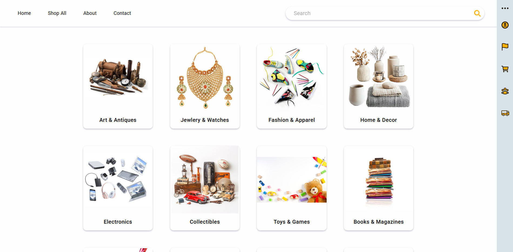
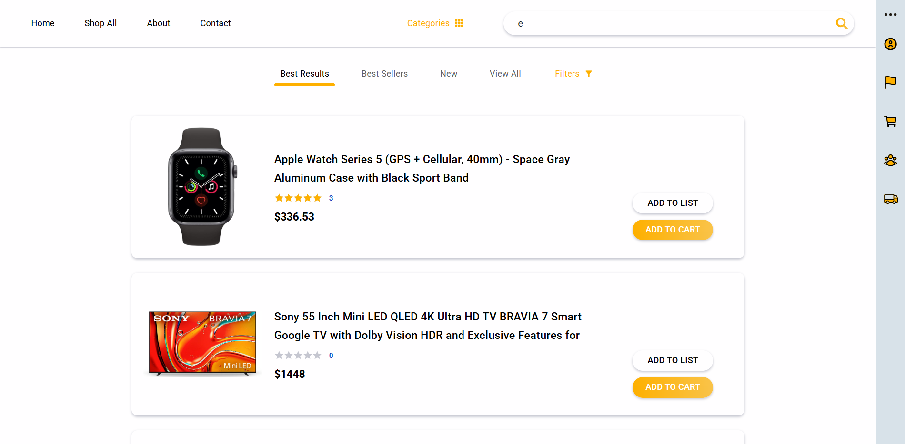
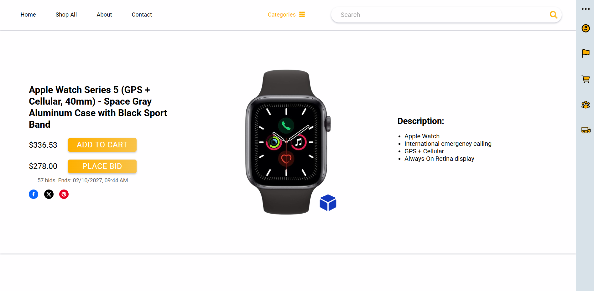
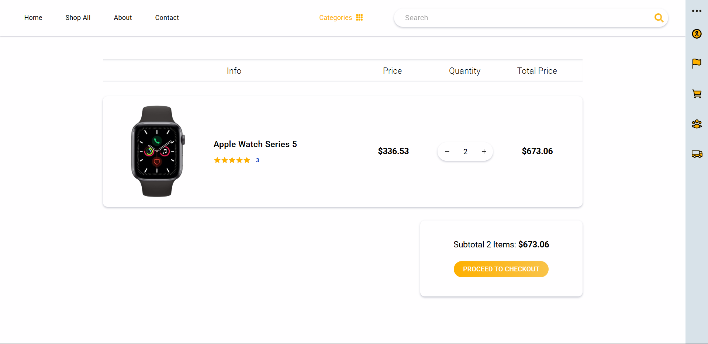
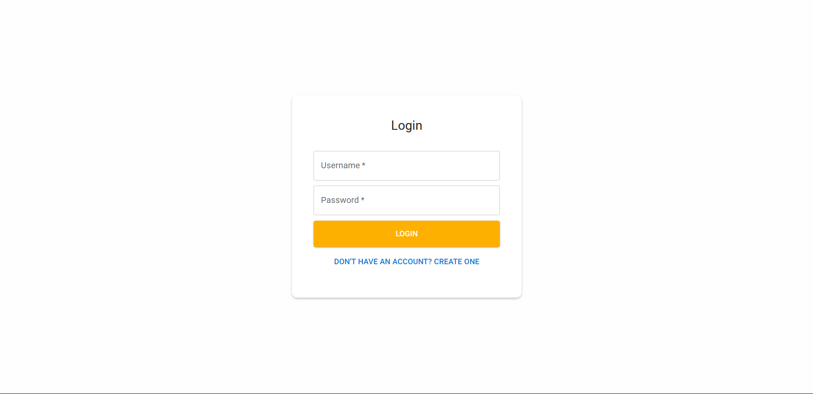
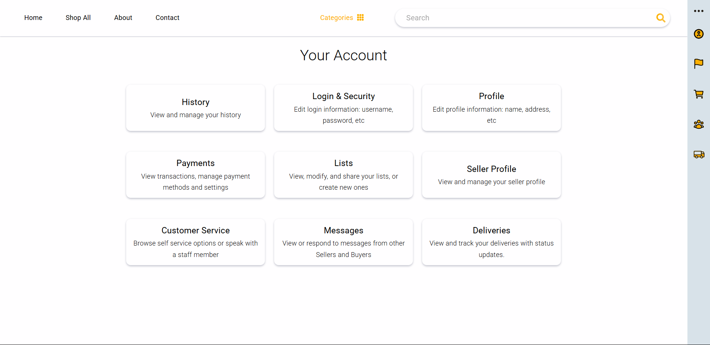

# Auction House/Ecommerce System

## Tech Stack

- Frontend: React, SASS, Material UI
- Backend: Flask (Python), Socket.IO
- Database: MySQL
- Third Party Services: MailerSend, Stripe, PostHog, Ozeki (Optional)

## Screenshots








## Setup

### React Frontend

1. Ensure you have [Node.js](https://nodejs.org/en/download) installed on your machine.
2. In a terminal, change to the `react-frontend` directory.
3. Run the `npm install` command to install node modules and required packages within the `package.json` file.

### Flask Server

1. In a terminal, change to the `flask-server` directory.
2. Run the `python -m venv .venv` command to install a virtual environment.
3. Run the `.venv/Scripts/activate` command to activate the virtual environment.
4. Run the `pip install -r requirements.txt` command to install the necessary dependencies.

### MySQL Database

1. Ensure you have [MySQL Workbench 8.0](https://dev.mysql.com/downloads/installer/) installed on your machine or any other MySQL database management tool.
2. Create a new database.
3. Use the name of this database in the .env file as `DB`.
4. In MySQL Workbench, click on `File` → `Open SQL Script`.
5. Select the required SQL file located in `mysql-database/Data Dumps/`.
6. Press `Ctrl` + `Shift` + `Enter` to run the script and import all tables and data into the database.
7. In MySQL Workbench, click on `Administration` → `Users and Privelages` → `Add Account`.
8. Use the credentials of this account in the .env file as `DB_USER` and `DB_PASSWORD`.

## Usage

### React Frontend

1. In a terminal, change to the `react-frontend` directory.
2. Run the `npm run dev` command to launch the React app.

### React Testing

1. In a terminal, change to the `react-frontend` directory.
2. Run the `npm test` command to run tests.

### React Environment Variables

Create a `.env` file in `react-frontend/` with the following format:
```dotenv
VITE_FRONTEND_URL=http://localhost:5173 (or whatever frontend url)
VITE_BACKEND_API_URL=http://127.0.0.1:5000/api (or whatever backend api url)
VITE_STRIPE_PUBLISHABLE_KEY=your_stripe_publishable_key
VITE_PUBLIC_POSTHOG_KEY=your_public_posthog_key
VITE_PUBLIC_POSTHOG_HOST=your_public_posthog_host
FAST_REFRESH=false
```

### Flask Backend

1. In a terminal, change to the `flask-server` directory.
2. Run the `.venv/Scripts/activate` command to activate the virtual environment.
3. Run the `python -m app.main` command to run the Flask server.

## Flask Environment Variables

Create a `.env` file in `flask-server/` with the following format:
```dotenv
PROJECT_ROOT=./
MAIL_DEFAULT_SENDER=your_mailersend_default_sender
ENCRYPTED_MAILERSEND_API_TOKEN=your_encrypted_mailersend_api_token
CIPHER_ENCRYPTION_KEY=your_cipher_encryption_key
SECRET_KEY=your_secret_key
FLASK_CONFIG=app.config.DevelopmentConfig
LIMITER_STORAGE_URI=memory://
FRONTEND_URL=http://localhost:5173 (or whatever frontend url)
BACKEND_MODEL_URL=http://127.0.0.1:5000/static/models (or whatever backend url with /static/models)
DB_HOST=your_mysql_host
DB_USER=your_mysql_user
DB_PASSWORD=your_mysql_password
DB=your_mysql_db
STRIPE_SECRET_KEY=your_stripe_secret_key
STRIPE_PUBLISHABLE_KEY=your_stripe_publishable_key
```

### Flask Testing

1. In a terminal, change to the `flask-server` directory.
2. Run the `pytest tests/ -W ignore::DeprecationWarning` command to run tests.
    1. We are ignoring depreciation warnings since they're for site-packages unrelated to our code.

### MySQL Database

1. MySQL Workbench will automatically be set to run on startup.
2. You can disable run on startup and manually run using the `net start MySQL80` command.
3. If you choose any other MySQL database management tool, follow the appropriate guides for usage.

## Other

### MySQL Database

1. There are models for the auctionhouse database located in `mysql-database/Models/` that can be accessed using MySQL Workbench

### Ozeki

1. You can disable run on startup and manually run using the `net start OzekiSystem` command.